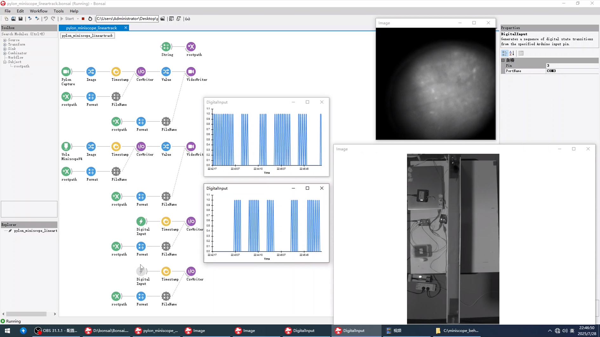

# Bonsai-Miniscope-LinearTrack Sync Platform

A synchronized system for recording neural activity (Miniscope V4), video (Pylon camera), and behavior (licking) for a 2-AFC spatial decision-making task on a linear track. The core of the system relies on Bonsai-RX for data stream management and a dual-Arduino setup for robust, real-time behavioral event detection and synchronization.

This project was developed as part of my in-vivo neuroscience research to study licking behavior in mice during reward-based behavioral tasks. I wanted to create a low-cost, modifiable alternative to com

## System Architecture

This system uses a dual-Arduino design to achieve high-sensitivity lick detection while maintaining compatibility with Bonsai's standard communication protocols.

* **Arduino 1 (Lick Detector)**:
    * Runs a custom firmware for highly sensitive lick detection, acting as a specialized sensor board.
    * When a lick is detected on the left or right spout, it outputs a clean, digital HIGH signal on a corresponding pin.
    * This approach avoids serial communication complexities and provides a simple digital trigger.

* **Arduino 2 (Bonsai Interface)**:
    * Runs the standard `StandardFirmata` firmware.
    * Receives the digital HIGH signals from the Lick Detector board.
    * Communicates directly with Bonsai's `DigitalInput` node, acting as a simple and reliable bridge between the custom sensor and the acquisition software.

* **Data Acquisition & Integration**:
    * `Bonsai` serves as the central hub to receive, process, visualize, and save all data streams (digital inputs from Arduino 2, Miniscope frames, Pylon frames) in a synchronized manner.

* **Neural Recording**: 
    A `Miniscope V4` system captures calcium imaging data from behaving mice.

* **Video Monitoring**:
    A `Basler Pylon` camera records the animal's behavior on the linear track.

## Hardware List

| Component | Model/Type | Role |
| :--- | :--- | :--- |
| **Microcontroller 1** | `Arduino Uno R3` | **Lick Detector**: Runs custom firmware for high-sensitivity detection. |
| **Microcontroller 2** | `Arduino Uno R3`  | **Bonsai Interface**: Runs StandardFirmata to communicate with Bonsai. |
| Calcium Imaging | `Miniscope V4` | Neural activity recording |
| Camera | `Basler Pylon Camera` | Behavior video recording |
| Lick Sensors | Custom-made lick spouts | Physical interface for licking |
| Resistors | `10MΩ` (x2) | High-resistance pull-ups for detection circuit |
| Linear Track | Custom-made, with a metal floor plate | Behavioral arena |

## Important Technical Notes & Best Practices

### 1. Power Supply for the Lick Detection Circuit (Arduino)

**The lick detection circuit is extremely sensitive to electrical noise due to the high 10MΩ pull-up resistors.** To ensure stable and reliable performance, you must use a clean, isolated power source for the Lick Detector Arduino.

* **Recommended Power Sources:**
    * A **USB power bank**.
    * A laptop running **on its own battery power**.
    * A laptop connected to its **original, properly grounded power adapter (transformer)**.

* **Sources to AVOID:**
    * Simple **AC-to-DC USB wall adapters/chargers**, which can introduce significant mains hum and noise.
    * A laptop connected to a **low-quality or non-isolated third-party charger**.

Failure to use a clean power source will likely result in false lick detections or a complete failure to detect licks.

### 2. Host PC Configuration for Bonsai

For stable, high-framerate data acquisition, please follow these guidelines for the PC running the Bonsai workflow.

* **Operating System**: The system has been tested and is recommended for use on **Windows 10**.
* **Stable Power**: Ensure the host PC has a consistent and stable power supply. Power fluctuations can disrupt high-throughput USB data streams from the cameras.
* **Performance Settings**: Set the Windows Power Plan to **"High Performance"** to prevent the CPU or USB ports from entering low-power states during recording. This is critical for maintaining a consistent framerate (e.g., 30 FPS) and preventing data loss.

## Setup & Installation

Follow these steps precisely to configure the hardware and software.

## Software & Dependencies

* **[Bonsai-RX](https://bonsai-rx.org/)**: Version `2.9.0`
    * Required Bonsai Packages:
        * `Bonsai.Pylon`
        * `Bonsai.Miniscope`
        * `Bonsai.Arduino`
        * `Bonsai.Vision.Design`
* **[Arduino IDE](https://www.arduino.cc/en/software)**: Version `Version: 2.3.3-nightly-20240614`
* **[Pylon Camera Software Suite](https://www.baslerweb.com/en/downloads/software/)**: Version `pylon Release 7.1.0.25066`

### 1. Arduino 1: Lick Detector Setup

This board is responsible for sensing the licks.

* **Hardware Wiring**:
    * Connect a **10MΩ** resistor between **Pin 2** and **5V**. The **left** lick spout is connected to **Pin 2**.
    * Connect a **10MΩ** resistor between **Pin 3** and **5V**. The **right** lick spout is connected to **Pin 3**.
    * The metal floor plate of the linear track must be connected to **GND**.
    * *Functionality*: When the mouse stands on the GND plate and licks a spout, it completes a circuit, pulling the corresponding pin LOW. The high-resistance pull-up resistors significantly increase detection sensitivity.

* **Firmware Upload**:
    * Open `arduino_firmware\detector_board\detector_board.ino`in the Arduino IDE.
    * Connect Arduino #1 to your PC via USB.
    * Upload the sketch to the board.

### 2. Arduino 2: Bonsai Interface Setup

This board acts as a bridge to Bonsai.

* **Firmware Upload**:
    * Connect Arduino #2 to your PC via USB.
    * In the Arduino IDE, navigate to `File > Examples > Firmata > StandardFirmata`.
    * Upload this `StandardFirmata` sketch to the board.

### 3. Inter-Arduino Connection

* Connect **Pin 8** of **Arduino #1** to **Pin 2** of **Arduino #2**. (Left Lick Signal)
* Connect **Pin 9** of **Arduino #1** to **Pin 3** of **Arduino #2**. (Right Lick Signal)
* Connect the **GND** pin of **Arduino #1** to the **GND** pin of **Arduino #2**. (Crucial for a common ground reference).

## Bonsai Workflow Guide (`pylon_miniscope_lineartrack.bonsai`)

This document provides instructions for configuring and running the main data acquisition workflow, located at:
`Bonsai-Miniscope-LinearTrack-Lickmeter/bonsai_workflow/pylon_miniscope_lineartrack.bonsai`

### Workflow Overview

As shown in the screenshot, this workflow is the central hub for the experiment. It is designed to simultaneously acquire, display, and save data from four distinct sources:
1.  **Pylon Camera:** Video of the animal on the linear track.
2.  **UCLA Miniscope V4:** Calcium imaging video.
3.  **Digital Input (Lick Left):** Timestamps of left lick events.
4.  **Digital Input (Lick Right):** Timestamps of right lick events.

All data is saved into a session-specific folder. Before running, you must configure the following nodes.

### Configuration Steps

After opening the workflow in Bonsai, select each of the following nodes and configure their properties in the **Properties** panel on the right.

#### 1. Set the Output Folder (`String` Node)

This node defines the name of the subfolder where all data for a given session will be saved.

* Select the `String` node at the top of the workflow.
* In its **Value** property, enter a unique identifier for your experiment (e.g., `MouseID_SessionDate`, like `M01_20250730`).
* All output files will be saved to the path: `C:\miniscope_behav_ttl\{Your_String_Value}\`. For example: `C:\miniscope_behav_ttl\M01_20250730\`

#### 2. Configure the Pylon Camera (`PylonCapture` Node)

This node connects to the Basler Pylon camera for behavior tracking.

* **serialnumber**: You must find your camera's unique serial number. To do this, open the official **Pylon Viewer** software provided by Basler. The serial number will be listed there. Copy and paste it into this field.
* **parameterfile**: This loads the pre-configured settings for the camera. You must provide the **absolute path** to the `lineartrack.pfs` file.
    * Example path: `C:\Users\YourUser\Documents\GitHub\Bonsai-Miniscope-LinearTrack-Lickmeter\pylon_configure\lineartrack.pfs`

#### 3. Configure the Miniscope (`UclaMiniscopeV4` Node)

This node connects to the Miniscope V4 DAQ.

* **Index**: This property determines which camera device the node connects to. The value is typically `0`, `1`, or `2`. If the miniscope view does not appear when you start the workflow, stop it, change the index to the next number, and try again until the correct image is displayed.

#### 4. Configure the Lick Detectors (`DigitalInput` Nodes)

There are two `DigitalInput` nodes for reading lick events from Arduino #2 (the one with StandardFirmata). You must configure both.

* **PortName**: Set this to the COM port of your **Arduino #2 (Bonsai Interface)**. You can find the correct COM port in the Windows **Device Manager** or the Arduino IDE.
* **Pin**: Set the `Pin` property to match the physical pin on Arduino #2 that is receiving the signal.
    * For the left lick detector, this should be **Pin 2**.
    * For the right lick detector, this should be **Pin 3**.

### Running the Experiment

Once all nodes are configured correctly, press the **Start** button in the toolbar to begin data acquisition. You should see four pop-up windows displaying the live data streams: the Pylon camera view, the Miniscope view, and two graphs showing the digital traces of the lick detectors.

## Code Description

### `arduino_firmware/`

The custom firmware on Arduino #1 is designed for one specific task: robust lick detection.

* It monitors input pins 2 and 3, which are connected to high-resistance pull-up circuits.
* Upon detecting a lick (a `LOW` signal on pin 2 or 3), it sets a corresponding output pin (`8` for left, `9` for right) to `HIGH`.
* This creates a clean, debounced digital signal perfect for the second Arduino to read, abstracting away the complexity of the analog detection.
* The firmware also includes serial messages (`Lick ON`, `Lick OFF`) which are useful for debugging with the Serial Monitor but are **not** used for the main Bonsai communication in this dual-board setup.

## License

This project is licensed under the MIT License - see the LICENSE file for details.